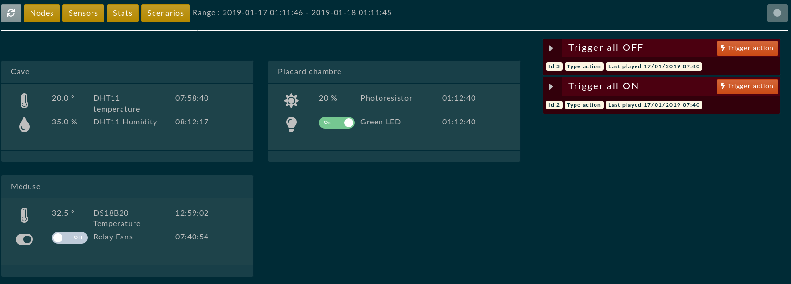
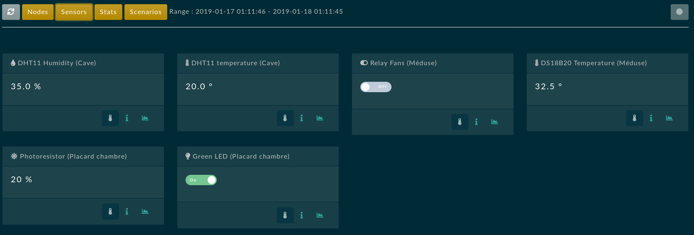
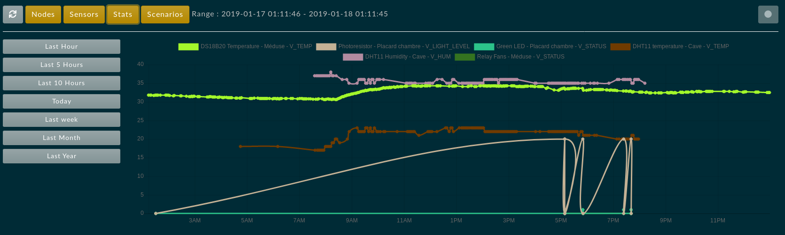
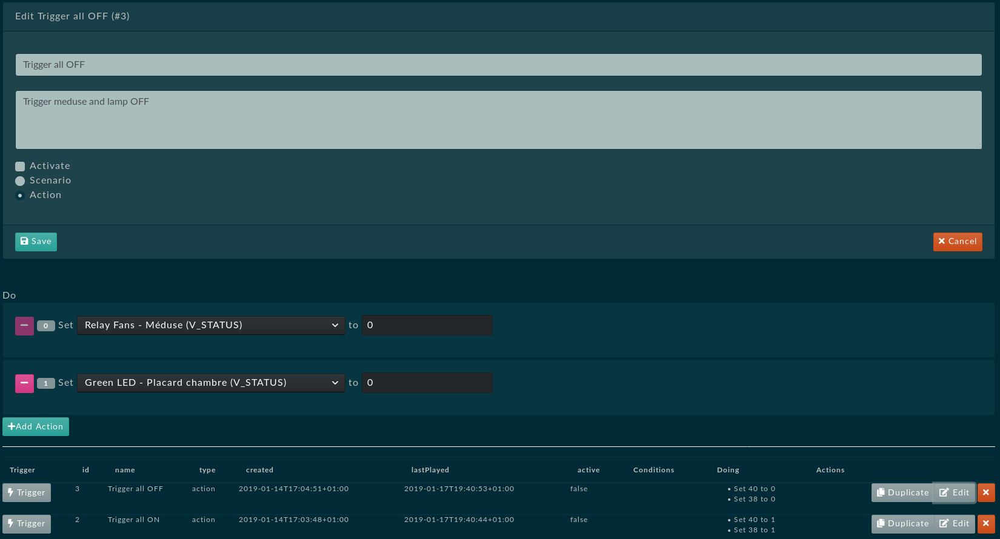

# MonitHomeBundle Documentation

### Note
!!! New controller as a standalone symfony/vuejs (one page app) is coming soon using mercure instead of websockets !!! 
!!! This is no longer up to date. !!! 

Please report any bug, feel free to contribute

### What is this about ?
* This symfony bundle is a controller for MySensors in early stage written in full php.
* It uses vue.js as front end engine to present datas and graph them.
* It uses dio extension to properly communicate with serial gateway (USB gateway)
* It uses websockets for a realtime communication between vuejs and php
	* As soon as a message (new value from node) is received from gateway (and treated)  it is pushed to vue, realtime here (wip to improving response time by optimizing ws requests/response time)
* Tested with Symfony 4.2 and PHP 7.2-7.3

# Presentation

### Prerequisites and limitations
* You *MUST* install php_dio extension (pecl extension) : this will allow php to access serial port directly and it is the only way to do good job with serial port. Actually no check is made so first double check this requirement (see after)!
* You need to run daemons in background via cron, nohup or screen (~4% memory on a raspberry pi)
	* One for websockets
	* One for retrieving and treat USB gateway infos
* Currently only works with a serial gateway (connected to USB) or emulated file gateway
* Your db must support `json_array` type natively (maria db >=10.2 or sqlite3)
* Specific server config (mod proxy for apache, detailled after)

### What it does ?
* Get and display current sensors status
  * Easy set activators with toggle button
  * Supported : `V_STATUS`, `V_LIGHT_LEVEL`,`V_TEMP`, `V_HUM` and more to come...
* Log received datas
  * Simply graph datas for each sensor with chartjs
  * Full graph with all sensors for a global view
  * Simple date range query logs
* Full and easy gateway debugging by launching daemon in verbose mode (-vvv)
* Trigger several actions at a time
	* WIP : Build scenario based on conditions
* Schedule actions
* Graph your network topology
* File emulator gateway for local testing purpose (no gateway needed to contribute)
* Dispatchs events on new messages receive from gateway
* Minimalistic REST API (need more attention)

### Todo
* Triggers and conditions
  * Currently only trigger action by hand or schedule action are supported
  * Conditions (scenario) are not yet implemented but present in interface
* Allow creation and modification of nodes via gui
  * currently only yaml definition is supported
  * Create new nodes and sensors on gateway's presentation message reception (auto mode)
* Test new message type (and sensors), new value, new unit and debug...
* Improve graphs datas (redondant big queries and not optimized formatting)
* Improve API in order to improve network transfert

## Installation and configuration

### Configure php dio Extension in php.ini files

Install from pecl
```bash
sudo pecl install channel://pecl.php.net/dio-0.1.0
```

Add dio extension in cli AND apache php ini conf !
```ini
# php -v 		=> current used php version
# php --ini 		=> current user php ini files
# php -m | grep dio 	=> check modules installed correctly
extension=dio
```

### composer install plugin
```bash
composer require extrablind/monithomebundle
```
### Register in `/config/bundles.php`
```php
return [
    # [...]
    Extrablind\MonitHomeBundle\ExtrablindMonitHomeBundle::class => ['all' => true],
];
```

### Register routes :  `/config/routes.yml`
```yaml
extrablind_monithome:
     resource: "@ExtrablindMonitHomeBundle/Resources/config/routing.yml"
```

### Configure bundle with file gateway (dev without usb gateway) `config/packages/dev/monithome.yml`
```yml
parameters:
  # Service used as gateway
  monithome.gateway.service: 'monithome.gateway.file'
  # Final uri for websockets
  monithome.ws.url: 'ws://localhost:54300'

extrablind_monit_home:
   gateway:
     file:
       # Path to the emulated gateway
       path: "%kernel.project_dir%/var/data/gateway.txt"

# Web Socket Configuration
# You will probably need to edit only firewall, hosts and port
gos_web_socket:
    client:
        firewall: dev # Example: secured_area, you must replace it by your firewall
    server:
        port: 1337         # The port the socket server will listen on
        host: 127.0.0.1     # The host ip to bind to
        router:
            resources:
                - "@ExtrablindMonitHomeBundle/Resources/config/ws/routing.yml"
    topics:
        - "@monithome.input.topic"
        - "@monithome.push.topic"
    pushers:
        wamp:
            host: 127.0.0.1
            port: 1337


```


### Configure bundle with usb gateway, example for a prod config  : `/config/prod/monithome.yml` :
```yml
parameters:
  monithome.gateway.service: 'monithome.gateway.usb'
  # See apache configuration for proxying !
  monithome.ws.url: 'wss://<yourdomain>/wss'

extrablind_monit_home:
   gateway:
     # Parameters for USB gateway
     usb:
       device: /dev/ttyUSB0
       baudrate: 115200
       bits: 8
       stop: 1
       parity: 0

# Web Socket Configuration
gos_web_socket:
    client:
        firewall: main
    server:
        port: 1337
        host: 127.0.0.1
        router:
            resources:
                - "@ExtrablindMonitHomeBundle/Resources/config/ws/routing.yml"
    topics:
        - "@monithome.input.topic"
        - "@monithome.push.topic"

    pushers:
        wamp:
            host: 127.0.0.1
            port: 1337
```

### Install assets
```bash
bin/console assets:install --symlink
```


### CHOWN your device
```bash
# You may need some additionnal rights here
sudo chown -R www-data:www-data /dev/ttyUSB0
```


### Doctrine schema create and  migrate
```bash
# !!! Must support json_array type natively (maria db >=10.2 or sqlite3). Currently tested on sqlite3 only... Please report any bug here for mysql or mariadb. Currently only tested with sqlite3
bin/console doc:mi:diff && bin/console doc:mi:mi
```

### Edit node and sensors definitions with your own network topology
```bash
# Double check this step
# See value types here : https://www.mysensors.org/download/serial_api_20
# A full commented example can be found in vendor/extrablind/monithomebundle/Resources/config/mysensors.sample.yml
bin/console mysensors:update var/data/mysensors.yml
```
```bash
# You can truncate all table before inserting with :
bin/console mysensors:update var/data/mysensors.yml --truncate
```

### Configuring the server

```bash
sudo a2enmod proxy_wstunnel
```
Configuring your virtual host (assuming you are in https)

```conf
# Websocket proxy
# wss redirects to working ws protocol
ProxyPass /wss ws://127.0.0.1:1337 retry=0 keepalive=On
ProxyPassReverse /wss ws://127.0.0.1:1337 retry=0
```

```bash
sudo service apache2 restart
```

## Starting the daemons
Without daemon you cannot communicate with the gateway, so no log, no event on new message received, no value updated from the gateway... NOTHING
Launching daemons is so... vital. It will run until you stop it, or disconnect from ssh (screen it or cron it to avoid this behavior).
Launch one daemon only.

!!! An unefficient watcher is looking if daemon is alive, and display in GUI
!!! WIP add restart command inside interface
!!! Always lauch websocket server (gos:websocket:server) before mysensor loop as it depends on it

#### The screen way (until computer reboot)
```bash
sudo apt-get install screen
screen bin/console gos:websocket:server
screen bin/console mysensors:daemon:start
# Type ctrl+a AND after ctrl+d to detach screen console
# screen -ls to see available detached screen.
```
Or use bash script `bash <project_dir>/bin/start.sh`
```bash
#/bin/bash
DIR="$( cd "$( dirname "${BASH_SOURCE[0]}" )/../" >/dev/null && pwd )"
cd $DIR
echo "> Working Directory : $DIR"
echo "> Kill previous process"
screen -X -S monithomesockets quit
screen -X -S monithomegateway quit
echo "> Screen start socket and gateway, then detach"
screen -S monithomesockets -d -m bin/console gos:websocket:server
screen -S monithomegateway -d -m bin/console my:daemon:start
exit
```

#### The cron way  (start on each reboot)
```bash
crontab -e
@reboot cd your/app/dir/ && bin/console gos:websocket:server
@reboot cd your/app/dir/ && bin/console mysensors:daemon:start
```
#### The test way
```bash
# A very verbose gateway to understand every message coming to you...
bin/console gos:websocket:server &
bin/console mysensors:daemon:start -vvv
```

## Optional configuration
### Security : do not permit access to api and monithome gui

By default all is accessible publicly, so be carefull on this.
!!! WIP : api should be prefixed with bundle name

```yml
# config/security.yml
access_control:
     - { path: ^/monithome, roles: ROLE_ADMIN }
     - { path: ^/api, roles: ROLE_ADMIN }
```

### You can extend bundle template with your own.

```bash
# create : template/bundles/ExtrablindMonitHomeBundle/Default/index.html
# don't forget parent() twig function
```

### Assets building (vuejs)
When working on the project you will need to build assets dynamically
```bash
cd <path_to_the_bundle>/Resources/vue/monithome
yarn encore dev --watch
```
For a production build do (please commit builded files and vue files) :
```yml
yarn encore production
# Then git commit
```

# Images




